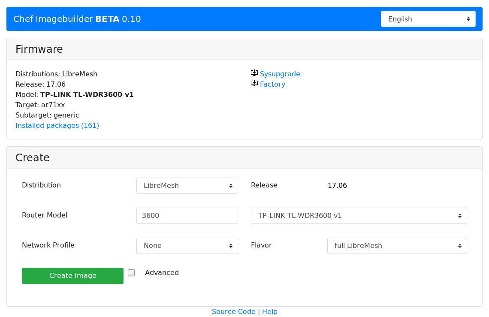

## Attended Sysupgrade Server

## Struktur

* Aktuelle Situation
* Lösung?
* Umsetzung
* API
* Security?
* Chef Online ImageBuilder

<section data-background-video="manual.webm" >

## Aktuelle Situation

* Hardware Informationen finden
* downloads.lede-project.org durchsuchen
* In Webinterface Firmware hochladen

--- 

* Mit **individuellen Packeten** wesentlich komplexer 
* lokaler ImageBuilder, Linux VM, Terminal

## Lösung?

<section data-background-video="sysupgrade.webm" >

## Umsetzung

### Client
* Router Informationen über `rpcd`
* HTTPS des Browsers
* `XMLHttpRequest` für Server Kommunikation
* `cgi-io` zum Upload
* **Javascript**

## Umsetzung

### Server
* Initialisierung aller ImageBuilder
* Parsen von `make info` + caching in Datenbank
* Erstellung von `make package_list`
* **Python3, Flask, PostgreSQL**

## Umsetzung

### Worker
* Baut Firmware & Kommuniziert mit Server
* Zukünftig auf OpenWrt/LEDE Basis
* Schnelles starten für Skalierung
* **Python3**

## API

* JSON Request an den Server
* Polling mit Hash des Requests
* HTTP Statuscodes für Build Fortschritt

### Sysupgrade Request

#### `/api/upgrade-request/`
<section>
	<pre><code data-trim data-noescape>
{
"distro": "openwrt",
"version": "snapshot",
"target": "x86",
"subtarget": "64",
"packages": [ 
	"libuci-lua",
	"uhttpd-mod-ubus",
	"<package>",
	...
]
}
	</code></pre>
</section>

### Sysupgrade Response

<section>
<pre><code data-trim data-noescape>
{
"log": "[url]/build-2ed8eaac0ee409f.log", 
"sysupgrade": "[url]/openwrt[...]-combined-squashfs.img.gz", 
"image_hash": "2ed8eaac0ee409f", 
"files": "[url]/325047d40bfa47a/", 
"request_hash": "4087ff013b36"
}
</code></pre>
</section>

## Security?

* Worker erstellt **sha256sums.sig**
* Server erstellt **worker-1.pub.sig**
* Client hat lokal **server.pub**

## Chef Online ImageBuilder

`https://chef.libreesh.org`

## Feedback?

GitHub: **@aparcar**

Source:

https://github.com/aparcar/attendedsysupgrade-server

https://libremesh.org

Danke an **@egon0** für den Server
